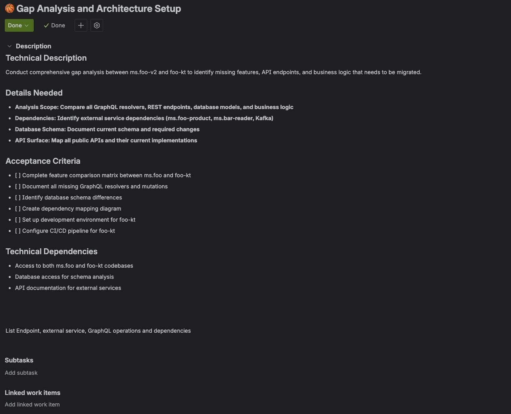
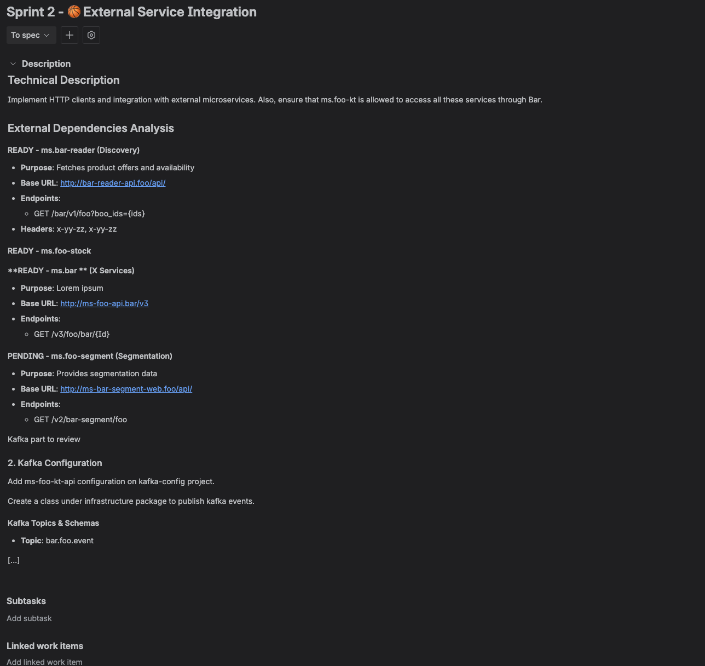

I hate to be switching over and over between the IDE, the task in Jira to review details, Confluence, or other docs to ensure I have the details, finding sometimes outdated docs, so I was curious how I could save time on that through AI. Every time we jump from writing code to updating a ticket or checking a requirement, we lose focus and momentum.

After some weeks testing, configuring, failing, and enjoying the process, I bring you here 5 situations that I found useful and saved me time. Your time is also important, so I added TL;DR in all the sections!

## Table of contents

## The Case Study: Node.js to Kotlin Migration
During a recent migration of a microservice from Node.js to Kotlin, I put this to the test. Basically, the AI should help not only to do a plan for migration, but also we needed ideas for a safe rollout, a list of all the endpoints, business rules, external dependencies, and adapt the plan for the team size, etc. I created a single workspace in my IDE containing the legacy Node.js project, the new Kotlin boilerplate, and another small service we were absorbing to provide all the context I thought relevant for once I start prompting in the IDE. 

By giving the agent access to this full context, along with a link to our "Backend Guidelines" page in Confluence, I could kickstart the documentation process. A migration is a big topic, with several steps:

1. Create a plan to migrate it, and add it to somewhere easy to edit, share, review with the team, update, comment -> a Confluence page
2. Divide the work according to the team size to achieve in a determined time -> a Feature in Jira with all the tasks related
3. Follow our internal guidelines and avoid generic results -> use the current documentation in Confluence to consider them in the code
4. Ensure the information in the tickets: Edit tasks descriptions, info, and adding comments with the info in the code
5. Code fast small features or tech debt -> Implementing a Jira ticket

## 1. Documentation on Autopilot: From Code to Confluence
**TL;DR:** Use the AI to analyze projects (or specific pull requests) to generate or update technical documentation in Confluence, provide it with the best context, ask it to improve the prompt; this will help to have your docs sync with your code with minimal effort.

Generating and updating documentation is a task many of us postpone or sometimes defer to the bottom of the backlog. With an integrated AI agent, you can delegate a significant portion of this work.

Why in a document? Because it's easier to read and review than in the agent chat, and I can edit what I want to precise or correct easily.
Why a conversation? Because I involved the agent in the decisions.
Why did you mention a conversation? Because I shared my idea with Gemini 2.5 Flash in the web to help me generate the best prompt for the Cursor Agent (which primarily runs on Gemini 2.5 Pro for coding tasks) with my ideas, and I asked it to ask me questions to ensure the best result.

After refining the prompt and editing some things, I ended with a big prompt with around 4k characters. It’s big, but needed to have a good start. Having the output in Confluence helped me to edit easily some sections, add or remove parts, add comments in some parts, and copy-paste some of the text to ask the AI if that was an assumption or something in the code (and guess what, there were some wrong assumptions, AI is not perfect, folks, yet).

Here is the final, structured prompt used to generate the migration plan:

```text
You are a Senior Solutions Architect tasked with creating a comprehensive and actionable migration plan. Project: Migrate the existing [Legacy Service Name] microservice (Node.js/TypeScript, GraphQL, REST) to the new [Target Service Name] microservice (Kotlin, Ktor, GraphQL)...
Write the output in **Confluence**, in the space for [Wiki Space ID] > [Parent Page], called "[Project Name] Node <> KT migration".
```

🔖 Add this to your prompts to improve results:

```text
Ask me any questions you find relevant have better information.
```

Then add them to a Google Doc or similar, it will be easier to answer. Then just copy all the question and answers.
‼️ I prefer to be specific with the destination link. Vague instructions can sometimes lead the AI to edit the wrong page. Double-check the target, I edited wrong documentation because there were two pages with the same title in different folders!

## 2. Intelligent Task Creation, Right From the Codebase
**TL;DR:** Define high-level constraints (time, team size) to have the AI decompose epics into manageable tasks. When you spot bad code, select it and instantly create a detailed tech debt ticket in Jira.

Whether you're breaking down a massive epic or flagging unexpected tech debt, you can create perfectly detailed Jira tickets without ever leaving your code.

For the migration project, I tasked the AI with planning. Here is the prompt used to decompose the epic into manageable, one-week tasks:

```text
Act as a senior project manager responsible for planning a microservice migration. **Context:** Based on the migration plan from Node.js to Kotlin for the [microservice A] to [microservice B] that we just finalized in our previous conversation, your task is to generate a detailed list of Jira tasks required to execute this plan...
**Final Step (Review):** Before you execute the creation in Jira, please present the full list of proposed tickets here in the chat for my review and final approval. This is a dry run.
```

After a bit of back-and-forth, I gave the final command to execute the creation in Jira.
A more powerful feature is on-the-fly tech debt flagging. We've all been there: you're working on a feature and stumble upon a piece of convoluted "spaghetti code." Instead of letting it slide, I now select the code block and prompt the agent:

```text
Create a tech debt ticket in Jira to refactor this. Explain that it has high complexity and doesn't follow our guidelines. Reference the file @path/to/the/problematic/file.js in the description and propose a solution explaining the why and how.
```

Using the `@` symbol to reference specific files is always better if you want to tag several files, try always to provide the best context for best results. It gives the AI precise, unambiguous context, leading to faster and more accurate results. You're not making it search; you're telling it exactly where to look.

## 3. Weaving Confluence Knowledge into Your Code
**TL;DR:** Provide the AI with links to relevant Confluence pages (e.g., coding guidelines, business logic) to use as context when generating or refactoring code.

How many times have you had to dig through Confluence to find that one specific business rule or coding standard? Now, you can bring that knowledge directly to the agent that writes your code.

When I need the AI to generate code that must adhere to complex business logic documented in Confluence, I start a conversation by providing the link. I first verify it has understood the content with a prompt like:

```text
Summarize the key business rules from this document regarding user authentication.
```

Once I confirm the agent has "ingested" the knowledge correctly, I can proceed with my code generation request.
🔖 If you don’t trust the AI answers 100% like me, I recommend you to ask something like:

```text
Explain to me how you took the info provided and how you adapted it and considered it in the code
```

This is currently the best way to provide external knowledge through Atlassian MCP. While Atlassian Intelligence is moving towards a future where the AI can automatically index and understand your entire Confluence space, the "link and verify" method is the best practice at the moment.

## 4. The IDE as Your Jira Cockpit
**TL;DR:** Use natural language commands in your IDE to add comments to tickets, change their status, or clarify descriptions, drastically reducing the need to switch to the Jira web UI.

Small, repetitive Jira actions add up, pulling you out of your coding mindset. You can execute most of these tasks with a single command from your editor. The actions that save me the most time are:

- **Adding Contextual Comments:** Highlighting a discrepancy in the code and telling the agent, "Add a comment to ticket XYZ explaining that the current implementation doesn't fit our business rules and requires extra development not considered in the task."
- **Changing Status:** Simple commands like "Move this ticket to 'In Progress' and give me a summary of the app" or "Move this ticket to 'Code Review' and push the code".
- **Clarifying Ticket Descriptions:** Sometimes a ticket's description is too vague. After discovering the necessary technical details, I'll ask the agent to update it.

‼️ However, be mindful of when editing a description is appropriate.
- **Good Practice (Clarification):** Adding technical notes, like "The new field must be encrypted in the database using AES-256." 
- **Bad Practice (Scope Creep):** Changing the core requirement. That should be a new ticket.


*Jira ticket created with generic description, generated in a bundle with several tasks*


*A different task, but this with detailed description after asking to improve it with code, links and relevant info*

## 5. From Jira Ticket to Code, and Beyond with Automation
**TL;DR:** For simple and well-scoped Jira tickets, you can ask the AI to generate the code just by providing the ticket link.

For well-defined, simple tasks, you can go from a Jira ticket link to functional code in minutes. This works best for tasks like:
- Adding a new optional field to an API endpoint.
- Changing UI label text for clarity or rewording.
- Adding missing translations.
- Generating unit tests for a function or improving test coverage.

🔖 The prompt is as simple as:

```text
Implement the changes described in this Jira ticket: [link].
```

The most important thing is to ensure a good description in the ticket. This leads to the next logical step: automation. For example, a powerful multi-action prompt:

```text
Document the endpoints of the [Legacy Service Name] Node.js project for migration. Follow these steps to generate a **Confluence** page and a **Jira** task...
```

This is the next frontier: a truly automated, intelligent development environment.

## 6. Setting Up Your AI Cockpit: MCP Atlassian Integration
**TL;DR:** Install the specific Atlassian MCP agent/plugin in your preferred editor (Cursor, IntelliJ, VS Code) and authenticate with your Atlassian workspace.

Since Cursor is built with AI capabilities from the start, the integration is often seamless. The Cursor agent uses Gemini 2.5 Pro as its underlying model for the deep reasoning and code generation tasks described.
1. Open Settings: Navigate to Settings (usually Cmd+, or Ctrl+,).
2. Find Integrations: Look for "MCP".
3. Connect Atlassian: Select the Atlassian integration option (Jira/Confluence) and follow the prompts. This connects the internal `atlassian-mcp-server` to your agent, granting it read access to your permitted documentation and ticketing.

## Conclusion
Integrating Atlassian's AI tools into your IDE isn't about replacing the developer. It's about augmenting our abilities by removing friction, having the developer focus on development, and avoid the satellite tasks that are repetitive. By handling the overhead of documentation, task management, and context gathering, it allows us to dedicate our most valuable resource—our focused brainpower—to what we do best: building bold and ingenious software.

AI created, Human-enhanced.
Daniel Artola.
