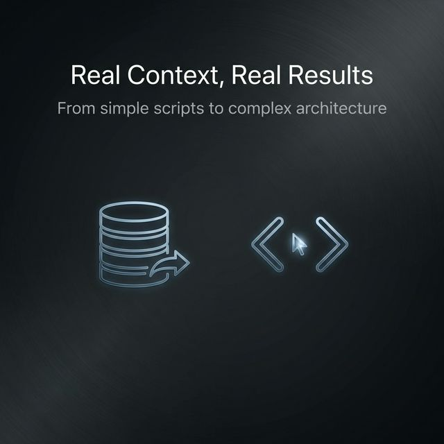

The AI agent that works for me at night (Jules) now supports MCP, incredible.

Jules is an autonomous AI agent that helps you with code tasks in your projects. I talked about him in a previous post (link below); I use him to leave simple tasks during the night and review them in the morning.

But this just got interesting. For a few days now, it integrates the use of MCP, connecting with some that I use almost daily in Antigravity such as Supabase, Context7 from Upstash, or Stitch.

This radically changes the way of working. It's no longer just isolated code; now you can ask for things with real context:

- **Supabase:** "Review the last 50 registered users who haven't verified their email and generate a script to clean those records."
- **Stitch:** "Implement the layout of the 'Homepage' view for the 'My habit tracker' project." (this one specifically is one of those cases I'm going to stop doing with Antigravity to pass it to Jules)
- **Context7:** "Configure a Cloudflare Worker script to cache JSON API responses for 5 minutes using Context7."

Now it is capable of assuming more complex tasks. More MCPs will surely be implemented soon, so, added to the quotas it offers, Jules is going to spend long nights writing code from now on.

Here are those links:

- [Building apps with AI](https://lnkd.in/efK2AS2N)
- [Jules MCP](https://lnkd.in/ewiU9YGw)
- [Jules Quotas](https://lnkd.in/eAPatCfk)
- [Supabase MCP](https://lnkd.in/eFhHC6XW)
- [Context7 MCP](https://lnkd.in/eu7h4nh3)
