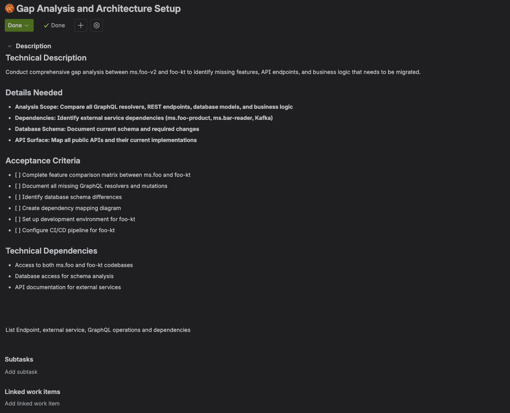
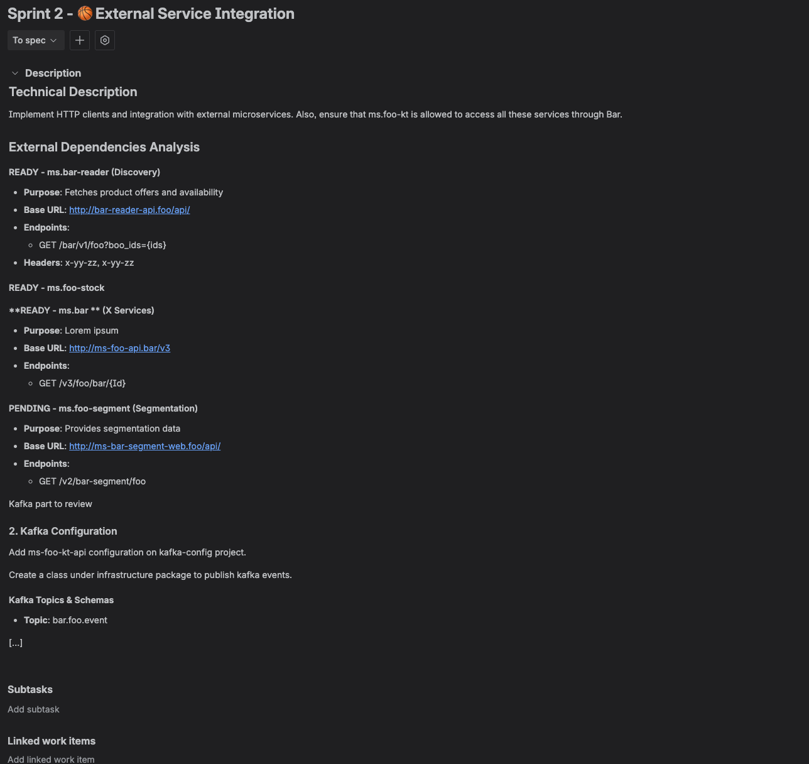

Odio tener que cambiar una y otra vez entre el IDE, la tarea en Jira para revisar detalles, y Confluence u otros documentos para asegurarme de que tengo toda la información o porque a veces encuentro documentos obsoletos, así que tenía curiosidad por saber cómo podría ahorrar tiempo en eso a través de la IA. Cada vez que saltamos de escribir código a actualizar un ticket o revisar un requisito, perdemos el foco y el impulso.

Después de algunas semanas probando, configurando, fallando y disfrutando del proceso, aquí te traigo 5 situaciones que encontré útiles y que me han ahorrado tiempo. Como tu tiempo también es importante, ¡he añadido un TL;DR en todas las secciones!

## Table of contents

## El Caso de Estudio: Migración de Node.js a Kotlin

Puse esto a prueba durante una reciente migración de un microservicio de Node.js a Kotlin. Básicamente, la IA no solo debía ayudar a hacer un plan para la migración, sino que también necesitábamos ideas para un despliegue seguro, una lista de todos los endpoints, reglas de negocio y adaptar el plan al tamaño del equipo. Creé un único espacio de trabajo en mi IDE que contenía el proyecto Node.js heredado, el nuevo boilerplate de Kotlin y otro servicio pequeño que estábamos absorbiendo, para proporcionar todo el contexto que consideré relevante al empezar a interactuar en el IDE.

Al darle al agente acceso a este contexto completo, junto con un enlace a nuestra página de "Guías Backend" en Confluence, pude poner en marcha el proceso de documentación. Una migración es un tema grande, con varios pasos:

1. Crear un plan para migrarlo y añadirlo a un lugar fácil de editar, compartir y revisar con el equipo -> una página en Confluence.
2. Dividir el trabajo según el tamaño del equipo para lograrlo en un tiempo determinado -> una Epic en Jira con todas las tareas relacionadas.
3. Seguir nuestras guías internas y evitar resultados genéricos -> usar la documentación actual en Confluence para considerarla en el código.
4. Asegurar la información en los tickets: Editar las descripciones de las tareas, la información y añadir comentarios en el código.
5. Programar pequeñas funcionalidades o deuda técnica rápidamente -> Implementar un ticket de Jira.

## 1. Documentación en piloto automático: Del código a Confluence

**TL;DR:** Pídele a la IA que analice proyectos (o Pull Requests específicos) para generar o actualizar documentación técnica en Confluence, proporciónale el mejor contexto y pídele que mejore el _prompt_; esto te ayudará a tener tus documentos sincronizados con tu código con un esfuerzo mínimo.

Generar y actualizar documentación es una tarea que muchos de nosotros posponemos o dejamos al final del backlog. Con un agente de IA integrado, puedes delegar una parte significativa de este trabajo.

¿Por qué en un documento? Porque es más fácil de leer y revisar que en el chat del agente, y puedo editar fácilmente lo que quiero precisar o corregir.
¿Por qué en una conversación? Porque involucré al agente en las decisiones.
¿Por qué mencionaste una conversación? Porque compartí mi idea con Gemini 2.5 Flash en la web para que me ayudara a generar el mejor _prompt_ para el Agente Cursor (que funciona principalmente con Gemini 2.5 Pro para tareas de codificación), y le pedí que me hiciera preguntas para asegurar el mejor resultado.

Después de refinar el _prompt_ y editar algunas cosas, terminé con uno grande de unos 4k caracteres. Es grande, pero necesario para tener un buen comienzo. Tener el resultado en Confluence me ayudó a editar fácilmente algunas secciones, así como copiar y pegar parte del texto para preguntarle a la IA si eso era una suposición o algo real en el código (y adivina, ¡había algunas suposiciones incorrectas! La IA no es perfecta todavía).

Aquí está el comando final y estructurado utilizado para generar el plan de migración:

```text
Eres un Arquitecto de Soluciones Senior encargado de crear un plan de migración asombroso. Proyecto: Migrar el microservicio existente [Nombre del Servicio Legacy] (Node.js/TypeScript, GraphQL, REST) al nuevo microservicio [Nombre del Servicio Destino] (Kotlin, Ktor, GraphQL)...
Escribe el resultado en **Confluence**, en el espacio [Wiki Space ID] > [Parent Page], llamado "[Nombre Proyecto] Node <> KT migration".
```

🔖 Añade esto a tus _prompts_ para mejorar los resultados:

```text
Hazme cualquier pregunta que consideres relevante para tener mejor información.
```

## 2. Creación inteligente de tareas, directamente desde el código

**TL;DR:** Define restricciones de alto nivel (tiempo, tamaño del equipo) para que la IA descomponga grandes épicas en tareas manejables. Cuando veas código malo, selecciónalo y crea al instante un ticket de deuda técnica detallado en Jira.

Ya sea dividiendo una épica inmensa o marcando deuda técnica inesperada, puedes crear tickets de Jira detallados sin salir de tu código.

Por ejemplo, para la planificación de la migración, le asigne a la IA la descomposición de la épica en tareas de una semana. Después de un intercambio, di el comando final para ejecutar la creación en Jira.

Una característica más poderosa es la identificación de deuda técnica sobre la marcha. Selecciono el bloque de código y le pido al agente:

```text
Crea un ticket de deuda técnica en Jira para refactorizar esto. Explica que tiene una alta complejidad y no sigue nuestras guías. Referencia el archivo @path/to/the/problematic/file.js en la descripción y propón una solución explicando el por qué y el cómo.
```

Usar el símbolo `@` para referenciar archivos específicos siempre es mejor, le dices exactamente a la IA dónde mirar.

## 3. Entrelazando el conocimiento de Confluence en tu código

**TL;DR:** Proporciona a la IA enlaces a páginas relevantes de Confluence (como directrices de código o reglas de negocio) para usarlas como contexto al generar o refactorizar código.

Al generar código que debe adherirse a lógicas de negocio complejas documentadas en Confluence, comienzo una conversación proporcionando un enlace. Primero compruebo que la IA haya entendido con:

```text
Resume las principales reglas de negocio de este documento sobre la autenticación de usuarios.
```

🔖 Si no confías al 100% en las respuestas de la IA, te recomiendo preguntar algo como:

```text
Explícame cómo tomaste la información proporcionada y cómo la adaptaste y consideraste en el código.
```

## 4. El IDE como tu cabina de mando de Jira

**TL;DR:** Emplea comandos de lenguaje natural en tu IDE para añadir comentarios en los tickets, cambiar su estado o aclarar descripciones, reduciendo drásticamente la necesidad de cambiar a la web de Jira.

Acciones que me ahorran mucho tiempo:

- **Añadir comentarios contextuales:** Resaltar una inconsistencia en el código y decirle a la IA que deje un comentario en el ticket.
- **Cambiar estado:** "Mueve este ticket a 'En Curso'".
- **Aclarar las descripciones:** Pedir a la IA que actualice descripciones vagas de tickets con información técnica descubierta sobre la marcha.

‼️ Sin embargo, ten cuidado.

- **Buena práctica (Aclaración):** Añadir notas técnicas.
- **Mala práctica (Ampliación de alcance):** Cambiar el objetivo central del ticket.


_Jira ticket creado con descripción genérica, generado en un paquete con varias tareas_


_Un ticket diferente, pero con descripción detallada tras mejorarlo con código, enlaces e información relevante_

## 5. Del ticket de Jira al código, y más allá con la automatización

**TL;DR:** Para tickets simples y bien acotados en Jira, pide a la IA que genere el código dándole el enlace del ticket. Esto abre la puerta a automatizar partes completas del ciclo de vida del desarrollo.

La siguiente frontera es tener entornos automatizados que puedan hacer múltiples acciones basadas en el contexto cruzado de Jira y Confluence desde el IDE.

## 6. Configurando el entorno: Integración de Atlassian MCP

**TL;DR:** Instala el agente/plugin específico de Atlassian MCP en tu editor preferido (Cursor, IntelliJ, VS Code) e inicia sesión con tu entorno de Atlassian.

## Conclusión

Integrar herramientas de IA en el IDE no se trata de reemplazar al programador. Se trata de eliminar la fricción, permitiendo que el desarrollador se enfoque en el desarrollo de software y evite las tareas repetitivas de gestión.

Creado por IA, Mejorado por humanos.
Daniel Artola.
