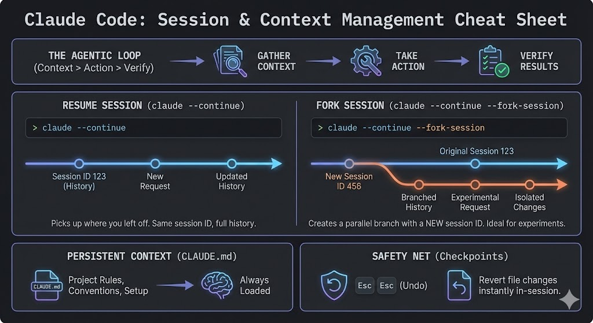

## Table of contents

Nuestros flujos de trabajo son intrínsecamente no lineales. Usamos ramas de Git para experimentar sin corromper la rama principal (`main`). Sin embargo, al interactuar con Claude Code, a veces tiramos millas en una sola conversa. Si una idea falla, borramos el contexto o empezamos de cero, perdiendo el contexto de esa sesión y gastando tokens para volver a generarlo.

Hasta hace poco solía exportar las conclusiones de una conversa en un Markdown para no perderlo. Pero ahora, aprovechando la gestión de sesiones de Claude Code, finalmente podemos tratar el contexto de la IA como un activo ramificable.

## El Bucle Agéntico: Por qué el contexto es costoso

A diferencia de un chatbot estándar, Claude Code opera en un **Bucle Agéntico**. Cuando le asignas una tarea, no se limita a "adivinar", sino que:

1.  **Recopila Contexto:** Indexa archivos, analiza contenido, mapea dependencias, etc.
2.  **Actúa:** Escribe código o ejecuta comandos en la terminal.
3.  **Verifica:** Ejecuta tu suite de pruebas para validar la solución, usa skills, consulta tu documentación…

Este bucle construye contexto para esa conversa. Reconstruir ese estado desde cero cada vez que quieres probar un enfoque o solución diferente es un desperdicio horrible de tokens y, sobre todo, de tiempo.

## El momento del Fork: De la Auditoría a la Acción

Tras una fase intensa de investigación, lo último que quieres es perder el progreso acumulado. Has analizado un problema, corregido a la IA, le has pedido que te haga preguntas para aclarar algunos temas… Aquí es donde diferenciamos dos formas de trabajar con el contexto:

-   **--resume:** Es el equivalente a seguir escribiendo en el mismo hilo. Útil para tareas lineales donde el objetivo es único y claro.
-   **/fork:** Es el equivalente a crear una rama a partir de un "commit" específico de tu auditoría.
- Si no usas **/rename**, puedes usar **claude --list** para ver tus sesiones y luego **claude --fork-session s4df92k1** para ramificar una sesión antigua específica.

Imagina que has pasado 20 minutos con Claude rastreando un error de concurrencia complejo. La IA ya ha mapeado los bloqueos, ha leído los logs y entiende perfectamente la condición de carrera. En este punto, tienes lo que llamamos una **"Auditoría Limpia"**. Te aconsejo tirar un `/rename` y ponerle un nombre descriptivo a esa sesión, como **audit_result**.

En lugar de empezar a aplicar parches que podrían "ensuciar" ese entendimiento o confundir al modelo con intentos fallidos, haces un **fork**. Si la primera estrategia de solución (por ejemplo, añadir un semáforo) complica demasiado el código o introduce efectos secundarios, simplemente descartas esa sesión. Tu "Auditoría Limpia" sigue ahí, intacta y con todo el contexto cargado, lista para que pruebes una segunda aproximación desde el punto exacto donde terminaste la investigación, sin tener que volver a explicarle nada a la IA.

## 🏗️ Caso Real: El "Fork de Decisión" como Tech Lead

### La Situación

Tienes que migrar una feature de un microservicio en Node JS a Kotlin.

### Sesión Base

1.  Le pides que analice el código del microservicio legacy.
2.  Le haces saber las Business rules y guidelines que debe seguir.
3.  Le das el conocimiento que necesita del microservicio destino (librerias, guidelines, arquitectura)
4.  Le pides que te pregunte las cosas que no tiene claras, contestas.

Con todo esto, el contexto esta listo para empezar siguientes pasos. Normalmente aquí exportaba todo lo comentado en un markdown para no perderlo. Ahora en este punto hago un `/rename`, le doy un nombre claro, hago un fork de la session, y ahi empiezo la siguiente fase.

## La Estrategia de Forking

Como Lead, en este punto puedes tener varias necesidades:

-   **Crear documentación:** empiezas a crear documentación y corregirlo. Si luego quieres hacer un plan, el contexto generado por la documentación es irrelevante, vuelve a la sesión original tira otro fork.
-   **Crear un plan:** Lo has creado y no te convence, o te habías dejado algo por analizar, o el plan esta mal de raíz. Descartas esa sesión, vuelves a la original, aclaras o añades lo necesario y le haces otro fork.
-   **Empezar a migrar:** Empiezas a migrar, y el modelo elegido no lo hace suficiente bien, o has empezado por migrar un endpoint para probar y al ver el resultado prefieres volver a hacerlo pero con TDD. Lo mismo, vuelta a la sesión original, otro fork y afinas tu prompt para migrar.

### El Resultado

Te has evitado ensuciar el contexto que habías pulido, y además puedes usarlo para tirar varias tareas en paralelo partiendo del mismo contexto limpio.

## Infraestructura de Seguridad: CLAUDE.md y Checkpoints

Para que este flujo de trabajo sea de grado de producción, Claude Code utiliza dos salvaguardas:

1.  **CLAUDE.md:** Piensa en esto como el "System Prompt" de tu repositorio. Almacena reglas de linting, comandos de prueba y patrones arquitectónicos. No importa cuántos forks crees, la IA se mantiene alineada con los estándares de tu equipo.
2.  **Checkpoints:** Claude toma instantáneas de tus archivos automáticamente antes de editarlos. Si un fork sale mal, un simple *undo* revierte el sistema de archivos al instante, no es que por tener mas forks fallidos vayas a dejar basura en el proyecto.

## Conclusión

Estamos pasando del "prompting" a la **Ingeniería de Contexto**. Para un Tech Lead, la capacidad de ramificar el razonamiento significa prototipar cambios complejos o paralelizar tareas con un mismo contexto sin distorsión en minutos en lugar de horas, manteniendo la sesión principal limpia y enfocada. Me he ahorrado un par de disgustillos con esto y docenas de archivos .md que se me acumulan.
