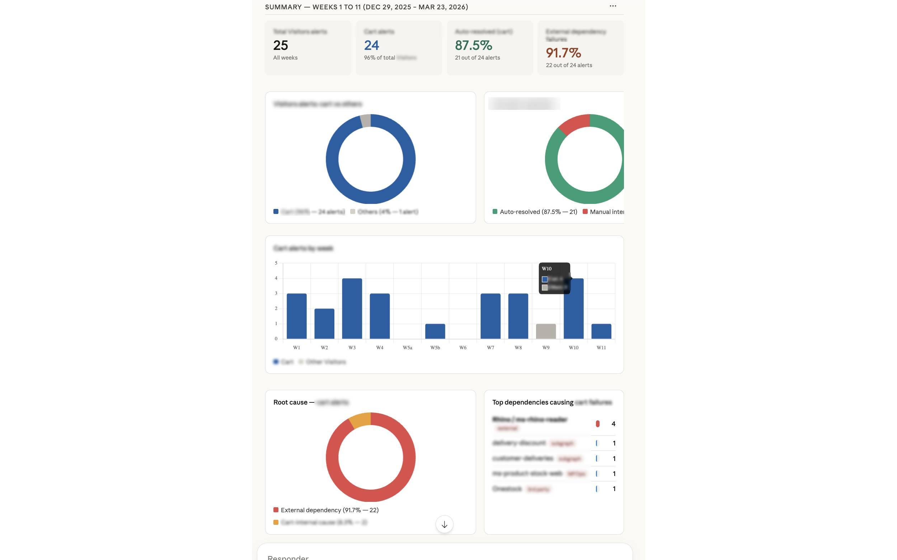
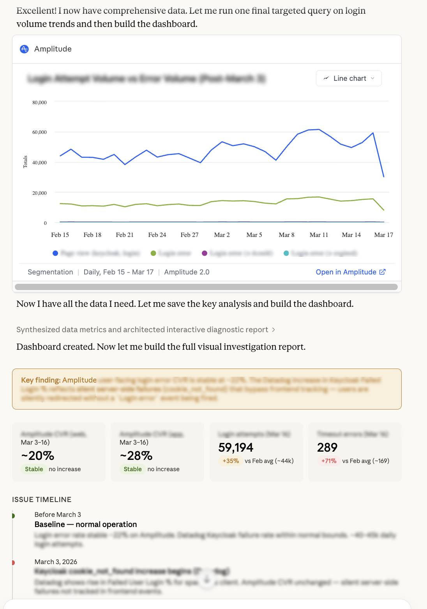
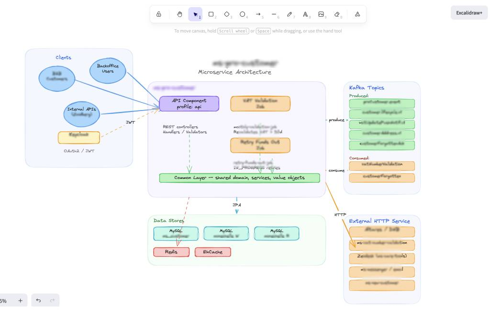

## Introducción

Como lead, hay varias tareas en las que he conseguido reducir drásticamente el tiempo invertido.

Analizar monitores, optimizar alertas, investigar incidentes, crear reportes/notebooks, crear diagramas, buscar y solventar inconsistencias… muchas de ellas gracias al uso de unos pocos MCP clave. Aquí te cuento cómo.

Sí, más allá de la polémica de si usar MCP o no. No dejan de ser una herramienta, no debería haber problema si lo usas para casos concretos y con conocimiento, igual que todo con la IA. Vaya, igual que no usas una motosierra para limar una astilla y encima sin leerte las instrucciones.

Hay varios MCP que uso a menudo: Atlassian, Context7, Playwright… pero te explico una lista de otros que, aunque no use a menudo, sí que me ayudan bastante para situaciones concretas.

## Mis MCP para casos concretos

### MCP Datadog

Con este, he podido analizar errores en producción, usarlo para analizar y mejorar las alertas y monitores en nuestros microservicios, incluso crear reportes sobre errores comparando los datos con Amplitude, lo que me lleva al siguiente caso.

### MCP Amplitude

Con amplitude estoy como pez fuera del agua, lo entiendo pero no lo domino. Gracias al mcp, he podido crear notebooks, analizar datos, extraer conclusiones de las bajadas o subidas pronunciadas, y combinado con el de Datadog se hace fácil tener una visión más amplia.

### MCP Excalidraw

No todo es mermaid, a veces quieres poder añadir y quitar cosas rápido y fácil. Me ayuda a generar mapas de arquitectura o de features concretos, y luego combinarlos, usarlos en documentación o simplemente para explicar una idea. Además, te permite generar el archivo o un enlace para verlo. Ojo, no expongas tu arquitectura en un enlace al público.

### MCP Miro

Aunque puedes crear diagramas incluso código con éste, donde más partido le he sacado ha sido para comparar información de diagramas enormes en Miro (de esos que parecen tableros de Dragones y mazmorras) con documentación de Confluence o código y encontrar discrepancias, y así anticipar bloqueos, problemas y ambigüedad en decisiones.

## Conclusión y enlaces

Todos los mencionados son oficiales de sus respectivas compañías, con lo que da un extra de seguridad. Eso sí, los tokens corren a tu cuenta, optimiza su uso.

Enlaces Oficiales a los MCP Mencionados:

- [MCP Datadog](https://docs.datadoghq.com/es/bits_ai/mcp_server/)
- [MCP Amplitude](https://amplitude.com/docs/amplitude-ai/amplitude-mcp)
- [MCP Excalidraw](https://github.com/excalidraw/excalidraw-mcp)
- [MCP Miro](https://developers.miro.com/docs/miro-mcp)
