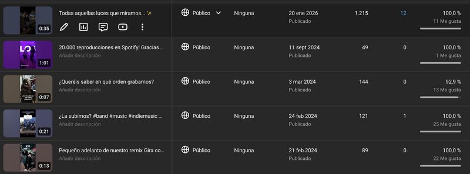
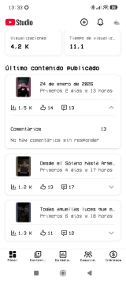

📈 El Short de YouTube que subí siguiendo las instrucciones de mi agente de IA tiene 10 veces más visualizaciones que los que hice con amor.

Trabajo a tiempo completo, programo, estudio, tengo una hija y 4 perros. Además, toco en una banda de pop rock como bajista y guitarrista (lo que sea menos cantar). 🎸 La verdad, me agobio solo de leerlo, pero no es para tanto.

Creé una Gem personalizada en Gemini con un único propósito: automatizar el contenido en redes del grupo porque no tenía tiempo ni energía para hacerlo con calidad. Como músicos queremos hacer música, no andar pensando en qué subir a redes.

_Comparativa de visualizaciones: el vídeo optimizado por IA destaca claramente._

Le inyecté datos reales de nuestra audiencia (sacados de APIs y pantallazos a granel, y procesados por Gemini) para que afinara más la estrategia y empezara a ejecutar. Solo esperaba hacer las cosas más rápido y sin pensar, pero resulta que también funciona mejor.

El primer vídeo donde seguí sus instrucciones a rajatabla (título, tendencia, edición, hashtags) tiene 10 veces más visualizaciones que los que hice a mano.

La IA me permite hacer cosas para las que no tenía tiempo ni continuidad. Antes ni me planteaba publicar. Ahora, me motiva hacerlo solo para ver cómo mejorar el cerebro de la Gema, aportándole más conocimiento y estrategias que investigo con NotebookLM.

He pasado de operario agobiado a director de orquesta, sin pasar por cursillos de marketing de pocamonta. La creatividad sigue siendo mía (de momento); la ejecución optimizada es suya.

👇 Si tienes una banda o gestionas una comunidad y quieres las instrucciones de la Gema, dímelo en comentarios del [post original](https://www.linkedin.com/posts/activity-7420224000468930560-dZvF?utm_source=share&utm_medium=member_desktop&rcm=ACoAAAyGEyEBSxx7QKU1cYLp8wTYjaf-v0rmmww) y te las paso.

And si te aburres te dejo los temas de mi banda, **Los Chicos del Sótano**:

- [Spotify](https://lnkd.in/edzmQZjw)
- [YouTube](https://lnkd.in/eSHWz3re)
