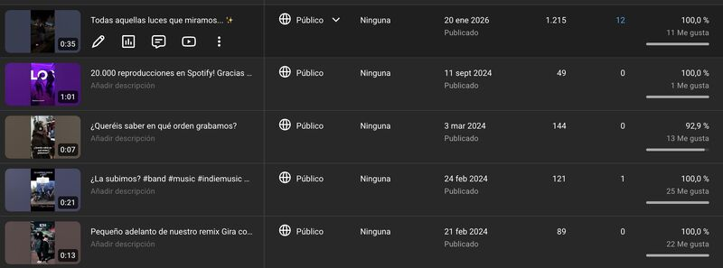
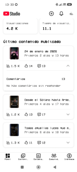

📈 AIエージェントの指示に従ってアップロードしたYouTubeのショート動画は、私が愛情を込めて作った動画の10倍の視聴回数を記録しました。

私はフルタイムで働き、プログラミングをし、勉強し、娘と4匹の犬を育てています。さらに、ポップロックバンドでベーシストおよびギタリストとして活動しています（歌うこと以外は何でもやります）。🎸 正直に言うと、これを読んだだけで圧倒されてしまいますが、実際はそれほど悪くありません。

私はGeminiでカスタマイズされたGem（ジェム）を一つだけ目的を持って作成しました。それは、品質を保ったままSNS用のコンテンツを作成する時間も気力もなかったため、バンドのSNSコンテンツを自動化することです。ミュージシャンとして、私たちはSNSに何をアップロードするかを考えるのではなく、音楽を作りたいのです。

_視聴回数の比較：AIで最適化された動画が明らかに際立っています。_

私は実際の視聴者データ（APIと大量のスクリーンショットから取得し、Geminiで処理したもの）をAIに注入し、戦略を調整して実行を開始できるようにしました。最初は、考えずに素早く作業を終わらせることだけを期待していましたが、結果的により効果的に機能することが分かりました。

タイトル、トレンド、編集、ハッシュタグなど、AIの指示に正確に従って作成した最初の動画は、手作業で作成した動画の10倍の視聴回数を記録しました。

AIのおかげで、これまで時間や継続性がなくてできなかったことができるようになりました。以前は投稿することすら考えていませんでしたが、今ではGemの頭脳をどのように改善するかを見るためだけに投稿するモチベーションが湧いています。NotebookLMで調査したさらなる知識と戦略をAIに提供しています。

私は、安っぽいマーケティングのコースを受講することなく、忙殺される労働者からオーケストラの指揮者へと変貌を遂げました。創造性は依然として私のもの（今のところは）ですが、最適化された実行はAIのものです。

👇 もしあなたがバンドやコミュニティを運営していて、Gemの指示を知りたい場合は、[元の投稿](https://www.linkedin.com/posts/activity-7420224000468930560-dZvF?utm_source=share&utm_medium=member_desktop&rcm=ACoAAAyGEyEBSxx7QKU1cYLp8wTYjaf-v0rmmww)のコメント欄で教えてください。お送りします。

そして、もし退屈しているなら、私のバンド **Los Chicos del Sótano** の曲をどうぞ：

- [Spotify](https://lnkd.in/edzmQZjw)
- [YouTube](https://lnkd.in/eSHWz3re)
